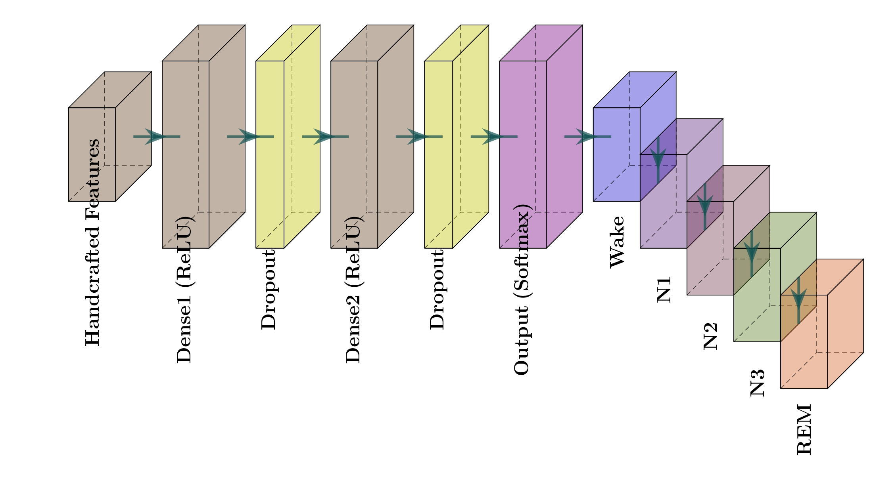
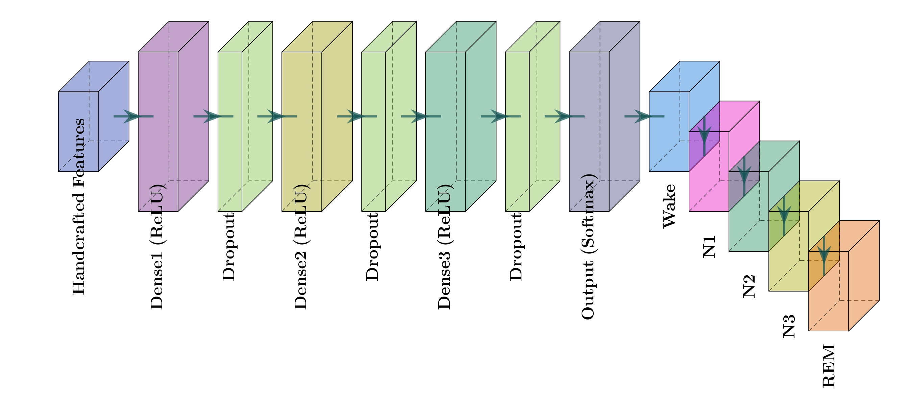
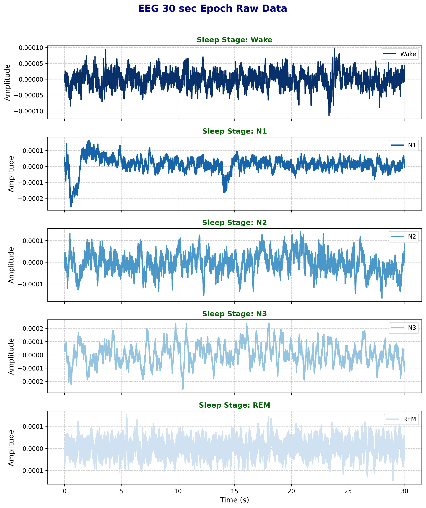

# Figures Gallery  
## Multimodal Pediatric Sleep Stage Classification

This document visually presents **all figures used in the IEEE paper** with correct rendering paths for GitHub.

---

## 1. Framework & Architecture

### Sleep Processing Pipeline

### Model Architectures

---

## 2. Signal Preprocessing

### EEG (F4–M1)

**Raw EEG**
%20New.png)

**Filtered EEG**
%20New.png)

**Standardized EEG**
.png)

---

### EOG (ROC–M1)

**Raw EOG**
%20New.png)

**Filtered EOG**
%20New.png)

**Standardized EOG**
.png)

---

## 3. Class Imbalance (SMOTE)

**Before SMOTE**

**After SMOTE**

---

## 4. Feature Extraction Visualizations

### Temporal Features

### Spectral Features

### Normalized PSD Features

### CWT Features

**EEG CWT**

**EOG CWT**

### Combined Feature Space

---

## 5. Classification Results

### Confusion Matrix

### Additional Outputs

.png)
.png)
.png)
.png)
.png)

---

## 6. Explainable AI (LIME)

### Global Feature Importance

### Instance-Level Explanations
.png)
.png)

---

## 7. Supplementary Visuals

.png)
.png)

---

## Notes
- All paths are **relative to `/Figures`** and render correctly on GitHub.
- Filenames with spaces are URL-encoded (`%20`) as required.
- Figures correspond exactly to those referenced in the IEEE paper.

