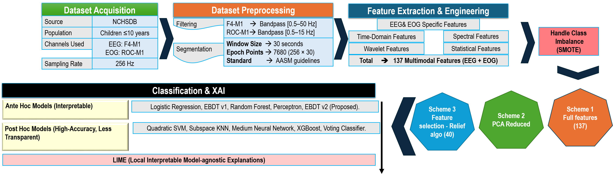
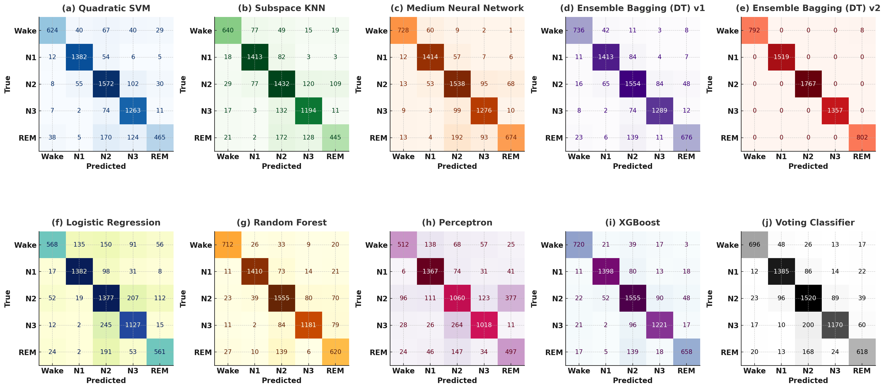
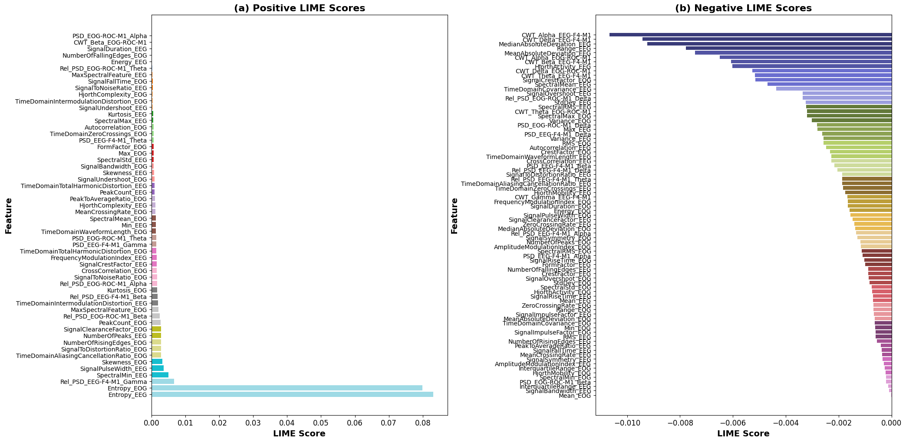

# Multimodal Pediatric Sleep Stage Classification

## Official IEEE Repository Documentation

This repository accompanies the IEEE research article:

**An Ensemble Learning Framework for Pediatric Sleep Stage Classification Using Multimodal EEG–EOG Signals, Multi-Domain Features, and LIME-Based Explainability**

It provides **full reproducibility**, **all experimental figures**, and **tabulated results** used in the paper.

---

## 1. Repository Structure

```
Multimodal-Pediatric-Sleep-Stage-Classification/
│
├── Code/        # Source code for preprocessing, feature extraction, training, evaluation
├── Dataset/     # Dataset access instructions (NCHSDB via NSRR/PhysioNet)
├── Figures/     # All figures used in the IEEE paper (shown below)
├── Results/     # Performance metrics and confusion matrices
├── LICENSE      # Apache 2.0 License
└── README.md    # This document
```

---

## 2. Dataset Description

- **Dataset:** Nationwide Children’s Hospital Sleep Data Bank (NCHSDB)
- **Subjects:** Pediatric patients (≤ 10 years)
- **Sampling Rate:** 256 Hz
- **Epoch Length:** 30 seconds (AASM compliant)
- **Sleep Stages:** Wake, N1, N2, N3, REM
- **Signals Used:** EEG (F4–M1), EOG (ROC–M1)

> ⚠️ Raw PSG data cannot be redistributed. Please request access via NSRR/PhysioNet.

---

## 3. Methodology Overview



**Pipeline Steps**
1. Channel selection (EEG + EOG)
2. FIR band-pass filtering
3. Epoch segmentation
4. Feature standardization
5. SMOTE class balancing
6. Multi-domain feature extraction
7. Ensemble learning
8. Explainable AI (LIME)

---

## 4. Signal Preprocessing Visualization

### EEG (F4–M1)

- Raw Signal  
%20New.png)

- Filtered Signal  
%20New.png)

- Standardized Signal  
.png)

---

### EOG (ROC–M1)

- Raw Signal  
%20New.png)

- Filtered Signal  
%20New.png)

- Standardized Signal  
.png)

---

## 5. Class Imbalance Handling (SMOTE)

- Before SMOTE  


- After SMOTE  


---

## 6. Feature Extraction Visualizations

### Temporal Features


### Spectral Features


### Normalized PSD Features


### CWT Features (EEG & EOG)


---

## 7. Classification Results

### Confusion Matrices


---

## 8. Explainable AI (LIME)

### LIME Feature Importance


LIME highlights entropy, spectral distribution, and PSD features as dominant contributors in sleep-stage prediction.

---

## 9. Performance Summary (From Paper)

| Model | Accuracy (%) | Weighted F1 (%) |
|------|-------------|-----------------|
| Quadratic SVM | 82.64 | 83.00 |
| Random Forest | 87.64 | 87.75 |
| XGBoost | 88.89 | 88.99 |
| EBDT v1 | 90.21 | 90.00 |
| **EBDT v2 (Proposed)** | **99.96** | **99.99** |

---

## 10. License

Licensed under **Apache 2.0** – free for academic and commercial use with attribution.

---

## 11. Citation

```bibtex
@article{PediatricSleep2026,
  title={An Ensemble Learning Framework for Pediatric Sleep Stage Classification Using Multimodal EEG--EOG Signals, Multi-Domain Features, and LIME-Based Explainability},
  journal={IEEE},
  year={2026}
}
```

---

## 12. Contact

**Corresponding Author:**  
Zeeshan Kaleem, Senior Member IEEE  
Email: zeeshankaleem@gmail.com

---

⭐ If this repository is useful, please consider starring it.
